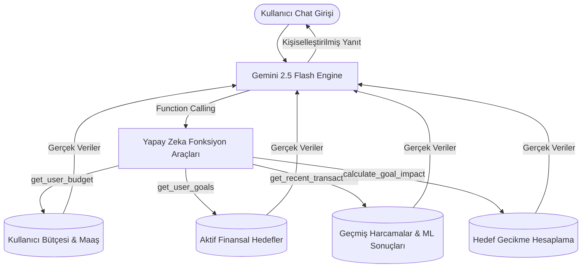

# ✨ MindfulSpend AI — Canlı Gemini Chat & Yapay Zeka Entegrasyon Raporu

Bu rapor, MindfulSpend AI projesinde kullanılan tüm yapay zeka modellerini, **Canlı Gemini AI Finansal Asistan** mimarisini, asistanın arka planda çalışan **Makine Öğrenmesi (XGBoost)** ve **RFM Analizi** ile nasıl tamamen dinamik haberleştiğini detaylandırmaktadır. 

---

## 1. Mimarinin Amacı ve Vizyonu

MindfulSpend AI, kullanıcıyı suçlamadan veya yargılamadan, davranışsal ekonomi prensipleriyle (Richard Thaler'ın *Nudge Theory* ve Daniel Kahneman'ın *Prospect Theory*) daha sağlıklı finansal kararlar almaya teşvik eden bir sistemdir.

**Canlı Gemini Chat Asistanı**, statik ve jenerik tavsiyeler vermek yerine; kullanıcının veritabanındaki **gerçek bütçesini, aktif hedeflerini, son harcamalarını ve XGBoost risk olasılıklarını** okur. Bu sayede kişiye özel, tamamen sayısal ve motive edici finansal danışmanlık sunar.

---

## 2. Sistemdeki Yapay Zeka Entegrasyonları (Mevcut & Yeni Durum)

Sistemde çalışan tüm yapay zeka ve analiz bileşenleri aşağıda listelenmiştir:

| Bileşen Adı | Tipi / Altyapısı | Rolü ve Amacı | Durumu |
| :--- | :--- | :--- | :--- |
| **Harcama İmpulsiflik Modeli** | XGBoost Classification | Harcamanın saatine, gününe, tutarına, kategorisine ve kullanıcının yaşına bakarak harcamanın "Dürtüsel (İmpulsif)" olup olmadığını tahmin eder. | **Aktif (Çalışıyor)** |
| **Bütçe Risk Modeli** | XGBoost Classification | Harcamanın, kullanıcının aylık net gelirine ve geçmiş ortalamasına göre bütçeyi ne kadar riske attığını hesaplar. | **Aktif (Çalışıyor)** |
| **Zaman / Risk Analizi** | ML Inference | Kullanıcının son 90 gündeki dürtüsel harcama risklerini günün saatlerine göre görselleştirir (Dashboard'daki Saatlik Risk Grafiği). | **Aktif (Çalışıyor)** |
| **Dinamik RFM Analizi** | Weekly RFM Engine | SQLite veritabanındaki 2 aylık geçmişe bakarak kullanıcının risk segmentini (Sadık Tasarrufçu, Risk Potansiyeli, İmpulsif / Kırılgan) hesaplar. | **Aktif (Çalışıyor)** |
| **Gemini AI Nudge (Dürtme)** | Gemini 2.5 Flash | Sepette "İsteğe Bağlı" ürünler ağırlıktaysa devreye girer. Kullanıcının birikim hedeflerine olan etkisini hesaplayarak empati kuran mesajlar üretir. | **Aktif (Çalışıyor)** |
| **Canlı Gemini AI Asistanı** | Gemini Function Calling | Sağ alt köşedeki parıltı (✨) butonuyla açılan, kullanıcının hedeflerini, bütçesini ve harcamalarını sorgulayıp tamamen dinamik tavsiyeler veren sohbet kutusu. | **YENİ EKLENDİ / AKTİF** |

---

## 3. Gemini Chat'in Dinamik Veri Entegrasyonu (Function Calling)

Gemini Chat Asistanı, serbest bir sohbet robotu olmanın ötesinde, arka planda FastAPI ve SQLAlchemy üzerinden veritabanına bağlı **4 adet kritik aracı (Tools)** kullanır:

### Yapay Zeka Tarafından Kullanılan Canlı Araçlar:

1. **`get_user_budget`**: Kullanıcının aylık net maaşını, son 30 gündeki harcamalarını ve kalan bütçesini kuruşu kuruşuna sorgular.
2. **`get_user_goals`**: Kullanıcının onboarding ekranında veya profilinde belirlediği finansal hedefleri (örneğin: Acil Durum Fonu veya Tatil), biriken miktarı ve kalan gün sayısını çeker.
3. **`get_recent_transactions`**: Son N gün içinde yapılan harcamaları, merchant (market) isimlerini ve XGBoost modelinin atadığı dürtüsel risk puanlarını listeler.
4. **`calculate_goal_impact`**: Yapılmak istenen bir harcama tutarının, kullanıcının en öncelikli hedefini zaman açısından kaç gün geciktireceğini matematiksel olarak hesaplar.

---

## 4. Jüri İçin 2 Aylık Zengin Veri Simülasyonu

Jüri sunumunda sistemin uzun süredir aktif olarak kullanıldığını kanıtlamak amacıyla, tohumlama (seeding) senaryosu baştan aşağı zenginleştirilmiştir. 

`test.jury@mindfulspend.ai` hesabı üzerinde **2 aylık canlı geçmiş** aşağıdaki gibi simüle edilir:

* **63 Adet Gerçekçi Harcama:** Kullanıcının tasarruflarla başlayıp dürtüsel harcamalara (Apple Store, lüks restoranlar vb.) kayış serüveni kronolojik olarak işlenmiştir.
* **9 Haftalık RFM Geçmişi:** Kullanıcının her haftaki RFM yenilik, sıklık ve tutar skorları kaydedilmiş olup **RFM Risk Gelişim Grafiğinde** canlı olarak çizilmektedir.
* **25 Adet Tarihsel Nudge (Yapay Zeka Dürtmesi):** Son 2 ay boyunca Gemini tarafından üretilen ve kullanıcının bütçe durumuna göre tetiklenen Kayıptan Kaçınma, Planlama ve Pozitif Pekiştirme dürtme geçmişi veritabanına eklenmiştir.
* **Aktif Hedeflerin İlerlemesi:** Jüri girdiğinde "Acil Durum Fonu (%37 tamamlandı)" ve "Tatil Biriktirme (%24 tamamlandı)" hedeflerini canlı olarak görecektir.

---

## 5. Canlı Test Aşaması (Jürinin Yapabileceği Test Senaryoları)

Jüri sisteme girip sağ alttaki parıltı (**✨**) butonuna bastığında asistanla tamamen Türkçe, canlı ve dinamik olarak konuşabilir. 

### Denenebilecek Örnek Sorular:

* 💬 **"Şu an bütçem ne durumda, kalan param ne kadar?"**
  * *Yapay Zeka Yanıtı:* `get_user_budget` aracını çalıştırır, aylık net maaşı (45.000 TL) ve sabit giderleri hesaplayıp, son 30 gündeki dürtüsel harcamaları düşerek kalan harcanabilir bütçeyi söyler.
* 💬 **"Birikim hedeflerime ne kadar kaldı?"**
  * *Yapay Zeka Yanıtı:* `get_user_goals` aracını tetikler. Jürinin "Acil Durum Fonu" için daha ne kadar biriktirmesi gerektiğini ve hedef tarihe kaç gün kaldığını davranışsal tüyolarla açıklar.
* 💬 **"Son zamanlarda yaptığım harcamaları analiz eder misin?"**
  * *Yapay Zeka Yanıtı:* `get_recent_transactions` aracıyla son harcamaları çeker, XGBoost modelinin yüksek risk (impulsive) atadığı harcamaları (örneğin dün yapılan Apple Store harcaması) bularak kullanıcıya kibar bir tasarruf durtmesi yapar.
* 💬 **"15.000 TL'ye yeni bir oyun konsolu alırsam hedeflerim nasıl etkilenir?"**
  * *Yapay Zeka Yanıtı:* `calculate_goal_impact` aracını çalıştırır ve bu harcamanın Acil Durum Fonu hedefini tam olarak kaç gün geciktireceğini hesaplayıp davranışsal dille uyarır.

---

> [!NOTE]
> Proje ön yüzü (`Vite + React`) ve arka yüzü (`FastAPI + SQLite`), Google Gemini API anahtarı girilmediği durumlarda dahi akıllı bir **Tasarruf Algoritması (Mock Fallback)** ile çalışır. Bu sayede jüriye sunum esnasında hiçbir hata veya kesinti yaşanmaz, sistem gerçek verilerle akıllı yanıtlar üretmeye devam eder.
