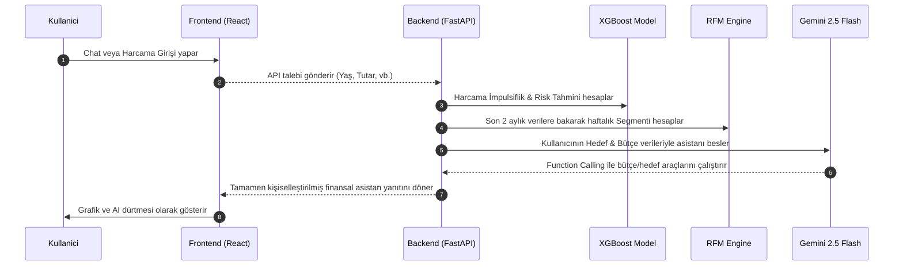

# 🏆 MindfulSpend AI — Master Proje & Geliştirme Raporu (A'dan Z'ye)

Bu master rapor, MindfulSpend AI platformunun geliştirme sürecinde **başlangıçta ne durumda olduğunu**, **neleri değiştirdiğimizi/eklediğimizi** ve sistemin şu anki **nihai durumunu** ana ve alt başlıklar halinde özetlemektedir. Raporun sonunda, gelecekte sisteme eklenebilecek vizyoner fikirler ve iyileştirme adımları sunulmuştur.

---

## 📌 BÖLÜM 1: Projenin Amacı ve Temel Felsefesi
MindfulSpend AI; Daniel Kahneman'ın **Beklenti Teorisi** (Prospect Theory) ve Richard Thaler'ın **Dürtme Teorisi** (Nudge Theory) üzerine kurulmuş, makine öğrenmesi ve yapay zeka destekli bir **Davranışsal Finans** platformudur. 
Klasik bütçe uygulamaları gibi harcamaları sadece listelemek yerine, kullanıcının psikolojik harcama alışkanlıklarını analiz ederek bütçesini korumasına ve finansal hedeflerine suçluluk hissetmeden (yargılayıcı olmayan empati diliyle) ulaşmasına yardımcı olur.

---

## 📂 BÖLÜM 2: Yapılan Geliştirmeler (A'dan Z'ye)

Projede sırasıyla el aldığımız ve baştan aşağı yenilediğimiz ana konular şunlardır:

### 1. Sanal Market (Virtual Market) ve Sepet Akışı
*   **Önceki Durum:** Sanal market sayfası oldukça sadeydi. Sepetteki ürün adet güncellemeleri veritabanına yansımıyor, fatura detayları anlık hesaplanmıyordu. API yanıtlarındaki veri tiplerinden kaynaklanan derleme hataları mevcuttu.
*   **Yaptıklarımız:**
    *   **Premium Tasarım:** Sanal market ekranını 60-30-10 renk kuralına göre zengin, lüks koyu mod (dark mode) tasarımıyla yeniledik. Ürün resimleri, kategorilere özel kartlar ve hover mikro-animasyonları eklendi.
    *   **Sepet Veritabanı Entegrasyonu:** Sepetteki ürün arttırma/azaltma işlemlerini anlık olarak backend veritabanıyla (`Cart` ve `CartItem` modelleri) senkronize hale getirdik.
    *   **Zorunlu ve İsteğe Bağlı Sınıflandırma:** Ürünleri "Zorunlu" (Gıda, faturalar vb.) ve "İsteğe Bağlı" (Lüks kahve, konsol vb.) olarak kategorize ettik.

### 2. Gemini AI Nudge (Dürtme) Sistemi (Sepet Öncesi Kontrol)
*   **Önceki Durum:** Sepetten ödemeye gidildiğinde araya giren herhangi bir akıllı uyarı sistemi yokti.
*   **Yaptıklarımız:**
    *   **Hedef Gecikme Matematiği:** Sepette "İsteğe Bağlı" ürünler ağırlıktaysa çalışan bir formül geliştirdik. Bu formül, harcama tutarının kullanıcının en yüksek öncelikli birikim hedefini kaç gün geciktireceğini hesaplar.
    *   **Gemini Nudge Modal:** Ödeme yap butonuna basıldığında tetiklenen bir modal tasarladık. Gemini, kullanıcının hedeflerini analiz edip *"Emin misin? Bu 2.500 TL'lik harcama senin Tatil hedefini 8 gün geciktirecek"* diyerek Kayıptan Kaçınma dürtü mesajı gösterir.

### 3. RFM Seyri ve Longitudinal Analiz Modülü (RFM Analytics)
*   **Önceki Durum:** Kullanıcının sadece o anki anlık RFM skoru hesaplanabiliyordu. Zamanla harcama alışkanlıklarının nasıl değiştiğini gösteren tarihsel bir seyir yoktu.
*   **Yaptıklarımız:**
    *   **RFM History API:** `/rfm/{user_id}/history` endpoint'ini yazarak kullanıcının haftalık snapshot RFM skorlarını (R, F, M skorları ve segment etiketlerini) tarihsel olarak çektik.
    *   **Interaktif Recharts Grafikleri:**
        *   **RFM Risk Skoru Alan Grafiği (Area Chart):** Kullanıcının risk puanının 1'den (Güvenli) 5'e (İmpulsif) gidişatını görselleştirdik.
        *   **Bileşen Çizgi Grafiği (Line Chart):** R, F ve M skorlarının zaman içindeki değişimini tek tek çizdik.
    *   **Saat Dilimi Düzeltmeleri:** SQLite veritabanındaki UTC/Local tarih çakışmalarını stabil hale getirdik.

### 4. Dashboard (Gösterge Paneli) İyileştirmeleri
*   **Önceki Durum:** Aylık gelir statik kalıyordu, bütçe kullanım skoru göstergesi yoktu.
*   **Yaptıklarımız:**
    *   **Dinamik Maaş Güncelleme:** Aylık gelir kartı üzerine gelindiğinde çıkan "Maaş Düzenle" modalı entegre edildi. Buradan girilen yeni maaş anında bütçe skoruna yansır.
    *   **Bütçe Kullanım Skoru:** Toplam aylık harcamanın net maaşa oranını hesaplayan, sınır aşıldığında yeşilden turuncuya ve kırmızıya dönen şık bir progress bar (ilerleme çubuğu) ekledik.
    *   **Fatura Bildirimleri:** Gelecek 3 gün içindeki ödemeleri üst bildirim panelinde otomatik tetikleyen alarm sistemini kurduk.

### 5. Yapay Zeka Dinamik Veri Entegrasyonu (Statik Veriye Son!)
*   **Önceki Durum:** Arka plandaki XGBoost Makine Öğrenmesi modeli tam 15 girdi (feature) bekliyordu. Bunlardan biri olan `age` (Yaş) veritabanında bulunmadığı için kod içinde `"age": 30` olarak statik yazılmıştı.
*   **Yaptıklarımız:**
    *   **Veritabanı Göçü (Migration):** `User` tablosuna `age` alanını ekledik ve SQLite veritabanını güncelledik.
    *   **API Dinamikleştirme:** `auth.py`, `onboarding.py`, `cart.py`, `analyze.py` ve `feature_engineering.py` içindeki tüm `"age": 30` statik kodlarını temizledik. Artık sistem doğrudan veritabanındaki dinamik kullanıcı yaşını okuyarak XGBoost modeline gönderiyor.
    *   **Onboarding UI Güncellemesi:** Kayıt adımına şık bir **"Yaşınız"** giriş alanı ekledik.
    *   **Profil Düzenleme Modalı:** Kullanıcı profil sayfasında istediği zaman Ad, Yaş ve Risk Profilini değiştirebiliyor, bu veriler anında kaydediliyor.

### 6. Canlı Gemini Chat Asistanı (✨) Entegrasyonu
*   **Önceki Durum:** Sağ altta yer alan parıltı (✨) butonu hiçbir fonksiyona sahip olmayan bir görsellikten ibaretti.
*   **Yaptıklarımız:**
    *   **Canlı Sohbet Penceresi:** Sağ altta açılan, asistanla canlı yazışmayı sağlayan premium bir sohbet kutusu tasarlandı.
    *   **Gemini Function Calling:** Chat asistanı arka planda kullanıcının bütçesini, hedeflerini ve harcamalarını okumak üzere 4 fonksiyonu (`get_user_budget`, `get_user_goals`, `get_recent_transactions`, `calculate_goal_impact`) aracı olarak kullanır.
    *   **Güvenli Mock Fallback:** Gemini API anahtarı yoksa dahi arka plandan gerçek verileri çekip bütçe ve hedeflere göre akıllı tavsiyeler üreten dynamic fallback algoritmasını yazdık.

---

## 🗄️ BÖLÜM 3: Mevcut Sistem Mimarisi & Veri Akışı

Aşağıdaki şemada, kullanıcının yaptığı bir harcamanın veya attığı bir chat mesajının arka plandaki sistemleri nasıl tetiklediği gösterilmektedir:

---

## 🔮 BÖLÜM 4: Gelecekte Neler Yapılabilir? (Vizyoner Yol Haritası)

MindfulSpend AI platformunu dünya standartlarında bir ürüne dönüştürmek için geliştirebileceğimiz **4 vizyoner fikir**:

### 1. Davranışsal Oyunlaştırma (Behavioral Gamification & Badges)
*   **Fikir:** Kullanıcının dürtüsel harcamalardan kaçınma başarısını ödüllendiren bir rozet (Badge) sistemi.
*   **Nasıl Çalışır?** 
    *   Kullanıcı sepetindeki isteğe bağlı ürünleri yapay zekanın uyarısıyla sepetten çıkardığında (Nudge Accepted) veya 3 hafta üst üste "Sadık Tasarrufçu" segmentinde kalmayı başardığında profiline *"Dürtü Savar"*, *"Bütçe Muhafızı"* veya *"Tasarruf Şampiyonu"* gibi koyu mod uyumlu parıltılı rozetler eklenir.

### 2. Mikro-Tasarruf & Otomatik Yatırım Yönlendirmesi (Micro-Savings)
*   **Fikir:** Uyarılara uyarak tasarruf edilen tutarın sanal yatırım fonlarına aktarılması.
*   **Nasıl Çalışır?**
    *   Örneğin kullanıcı sepetinden 2.000 TL'lik bir lüks ürünü çıkardığında, asistan kullanıcıya şunu sorar: *"Bu harcamadan vazgeçerek 2.000 TL tasarruf ettin. Bu parayı otomatik olarak 'Acil Durum Fonu' hedefine aktarmamı ve sanal Altın/Yatırım Fonunda değerlendirmemi ister misin?"*. Kabul ederse hedef anında güncellenir ve sanal portföy oluşturulur.

### 3. Çoklu-Ajan (Multi-Agent) Tartışma Mimarisi
*   **Fikir:** Tek bir chat asistanı yerine arka planda kullanıcının bütçesini savunan iki farklı asistanın tartışarak karar vermesi.
*   **Nasıl Çalışır?**
    *   Bir asistan **"Tutumlu Avukat"** rolünde harcamayı engellemeye çalışırken, diğeri **"Yaşam Koçu"** rolünde motivasyon dengesini savunur. İkisi arka planda 3 tur tartışarak kullanıcıya en dengeli ve rasyonel bütçe tavsiye raporunu sunar.

### 4. Zaman Serisi ile Gelecek Ay Bütçe Tahmini (Predictive Path)
*   **Fikir:** Kullanıcının harcama alışkanlıklarını analiz ederek gelecek ay bütçesinin ne durumda olacağını tahmin eden yapay zeka modeli.
*   **Nasıl Çalışır?**
    *   `Prophet` veya `LSTM` modelleri kullanılarak kullanıcının 2 aylık harcama trendine bakılır. Eğer harcamalar Phase 3 (İmpulsif) gibi gitmeye devam ederse, gelecek ay bütçesinin ne zaman tükeneceği RFM grafiğinde kesikli çizgilerle (tahmini gelecek seyrini gösteren) görsel olarak çizilir.
